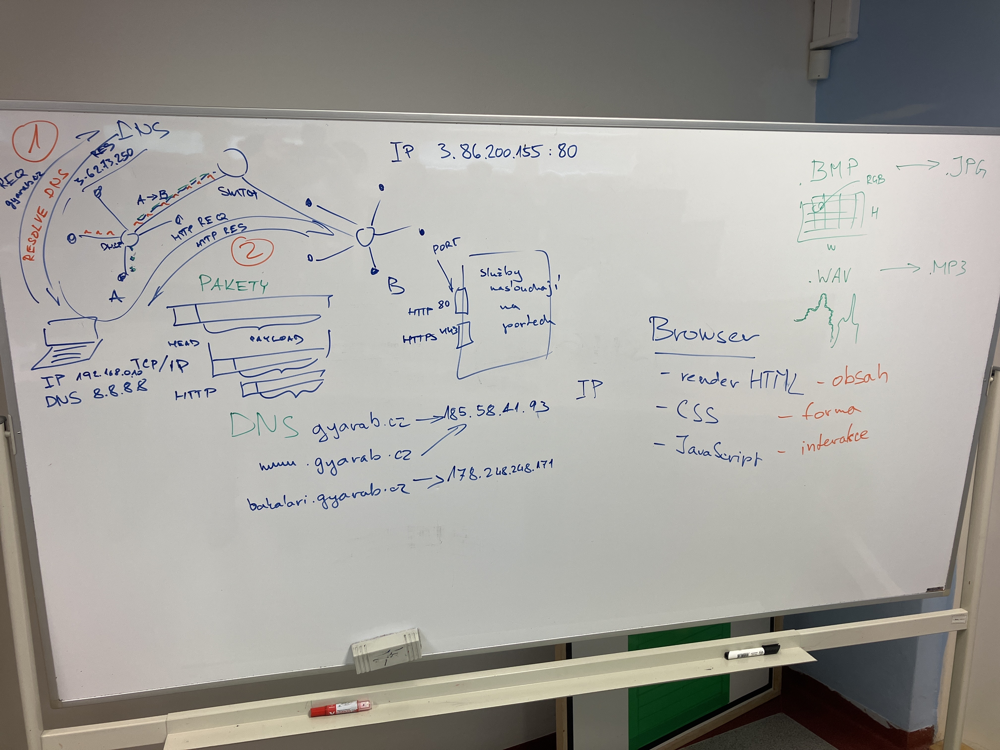

# WA-hodina 10. 11.

## Obsah
- na hodině jsme říkali o základní stavbě a internetu
- pověděli jsme si o víhodě posílání informací pomocí paketů
- vysvětlili jsme si jak funguje DNS
- zjistili jsme na jakých portech obvykle běží protokoly HTTP - 80, HTTPS - 443
- řekli jsme si o komprimaci dat (např. `.BMP -> JPG`)